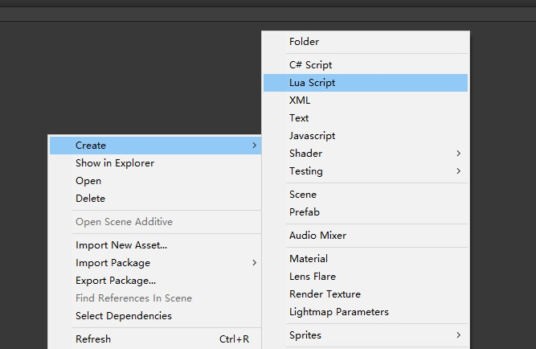

# Unity_CreateScriptExtension
Unity脚本创建扩展，可以模板创建C#脚本一样创建其它扩展名的文件，并可以对每种扩展名文件定义模板,该工具已经完成右键创建Lua,XML,Text文件的创建功能.


## 使用方法
导入unitypackage资源包后，可以像创建C#代码一样，去创建Lua,Xml,txt格式的代码或文件.




## 添加其它格式文件
1. 创建模板文件   
  在felixwee/templates/目录中创建你的模板文件,例如：XXX_template.md
2. 在felixwee/scripts/DevExtEditor.cs代码中添加快捷菜单项

```cs
/* 创建常用文件类型扩展 */
    [MenuItem("Assets/Create/Text", false, 81)]
    public static void CreateText()
    {
        //获取创建代码时的文件路径下的所有对象
        UnityEngine.Object[] arr = Selection.GetFiltered(typeof(UnityEngine.Object), SelectionMode.TopLevel);
        //根据第一个文件获取不前文件夹路径
        string folder = AssetDatabase.GetAssetPath(arr[0]);

        //将焦点定位到某个文件，并进行重命名       
        //id,回调处理，新建文件url,图标，源始文件url   
        ProjectWindowUtil.StartNameEditingIfProjectWindowExists(0, ScriptableObject.CreateInstance<CreateFileAction>(), folder + "/XXX.md", null, "Assets/Editor/felixwee/templates/XXX_template.md");
    }
```

## 下载插件包

点击[下载](https://github.com/felixweecn/Unity_CreateScriptExtension/releases)
